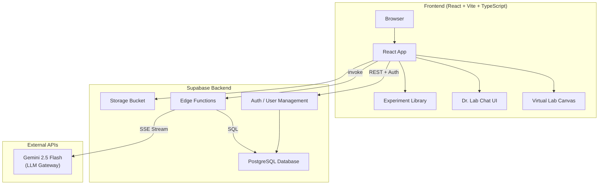

# Welcome to LabAI Project by FWD

<p align="center">
  
  
  
  
  
  
  
</p>

## Live Demo

Experience the app live at: **[https://app-ccsvi1y42nlt.appmedo.com](https://app-ccsvi1y42nlt.appmedo.com)**

## Screenshots

| Landing Page | Subject Explorer |
|:---:|:---:|
|  |  |
| **Virtual Laboratory** | **Biology Experiments** |
|  |  |

## About LabAI

LabAI is an **AI-powered virtual laboratory assistant** built for STEM education. It combines an intelligent chat tutor, an interactive virtual lab bench, and a curated experiment library to help students explore Chemistry, Biology, Physics, Computer Science, and Mathematics through hands-on, guided learning.

### Key Features

- **AI Lab Assistant (Dr. Lab)** — Ask questions, get step-by-step experiment guidance, and receive real-time feedback from an AI tutor powered by a large language model.
- **Virtual Lab Bench** — Drag-and-drop laboratory equipment (beakers, flasks, burners, burettes, microscopes, petri dishes) to perform realistic simulations with dynamic chemical and biological reactions.
- **Experiment Library** — Browse 80+ curated experiments across five STEM subjects, each with learning objectives, difficulty levels, and estimated durations.
- **Interactive Visualizations** — 10 unique animated canvas visualizations for Computer Science concepts including binary search, sorting algorithms, graph traversals, dynamic programming, Big-O complexity curves, hash tables, recursion stacks, finite state machines, and more.
- **Stand Snap-Clamp System** — Equipment like test tubes and flasks automatically snap to retort stands and move together when dragged, mimicking real lab behaviour.
- **Chemistry & Biology Modes** — Switch between chemistry reactions (titrations, precipitation, combustion) and biology simulations (staining, osmosis, enzyme activity, cell division).
- **Real-Time Reactions** — Mix reagents to trigger colour changes, gas evolution, precipitate formation, temperature shifts, and bio-staining effects with animated feedback.
- **Responsive Design** — Fully responsive interface optimized for desktop, tablet, and mobile learning environments.
- **Supabase Backend** — Robust data layer with user authentication, experiment progress tracking, and cloud-persistent lab states.

## System Architecture



**Data Flow:**
1. The React frontend serves the UI and handles client-side state for the virtual lab canvas.
2. User authentication and experiment metadata are stored in Supabase Auth + PostgreSQL.
3. The **Dr. Lab** AI assistant sends chat messages to the `large-language-model` Edge Function.
4. The Edge Function proxies the request to the Gemini 2.5 Flash LLM gateway via SSE streaming.
5. Responses stream back to the chat UI in real time, token by token.

## LLM Configuration (Dr. Lab)

Dr. Lab uses a Supabase Edge Function to securely call the Gemini 2.5 Flash LLM. The API key never touches the client.

### Prerequisites

- A Supabase project with Edge Functions enabled
- The `INTEGRATIONS_API_KEY` secret configured in your Supabase project (injected automatically by the platform)

### Frontend Environment Variables

Create a `.env` file in the project root:

```bash
VITE_SUPABASE_URL=https://your-project.supabase.co
VITE_SUPABASE_ANON_KEY=your-anon-key
VITE_APP_ID=your-app-id
```

These variables are used by `src/lib/llm.ts` to build the Edge Function URL:

```typescript
const FUNCTION_URL = `${supabaseUrl}/functions/v1/large-language-model`;
```

### Edge Function

The `edge-functions/large-language-model.ts` file handles the LLM proxy:

- Accepts `POST` requests with either `{ contents }` (Gemini-native) or `{ system, messages }` (Anthropic-style) format.
- Reads `INTEGRATIONS_API_KEY` from `Deno.env.get()` — **do not hardcode this key**.
- Streams the response back as SSE (`text/event-stream`).
- Forwards `429` (rate limit) and `402` (quota) errors verbatim to the client.

### Deploy the Edge Function

```bash
supabase functions deploy large-language-model
```

### How Dr. Lab Works

1. The user types a question in `AIChatPanel.tsx`.
2. `streamDrLab()` in `src/lib/llm.ts` sends the message plus the `DR_LAB_SYSTEM_PROMPT` to the Edge Function.
3. The Edge Function forwards the payload to Gemini 2.5 Flash.
4. Tokens stream back through SSE and are appended to the chat bubble in real time.
5. Quiz generation also reuses this pipeline — `generateQuiz()` calls `streamDrLabBlocking()` with a JSON-formatting prompt.

## Project Info

## Project Directory

```
├── README.md # Documentation
├── components.json # Component library configuration
├── index.html # Entry file
├── package.json # Package management
├── postcss.config.js # PostCSS configuration
├── public # Static resources directory
│   ├── favicon.png # Icon
│   └── images # Image resources
├── src # Source code directory
│   ├── App.tsx # Entry file
│   ├── components # Components directory
│   ├── context # Context directory
│   ├── db # Database configuration directory
│   ├── hooks # Common hooks directory
│   ├── index.css # Global styles
│   ├── layout # Layout directory
│   ├── lib # Utility library directory
│   ├── main.tsx # Entry file
│   ├── routes.tsx # Routing configuration
│   ├── pages # Pages directory
│   ├── services # Database interaction directory
│   ├── types # Type definitions directory
├── tsconfig.app.json # TypeScript frontend configuration file
├── tsconfig.json # TypeScript configuration file
├── tsconfig.node.json # TypeScript Node.js configuration file
└── vite.config.ts # Vite configuration file
```

## Tech Stack

Vite, TypeScript, React, Supabase

## Development Guidelines

### How to edit code locally?

You can choose [VSCode](https://code.visualstudio.com/Download) or any IDE you prefer. The only requirement is to have Node.js and npm installed.

### Environment Requirements

```
# Node.js ≥ 20
# npm ≥ 10
Example:
# node -v   # v20.18.3
# npm -v    # 10.8.2
```

### Installing Node.js on Windows

```
# Step 1: Visit the Node.js official website: https://nodejs.org/, click download. The website will automatically suggest a suitable version (32-bit or 64-bit) for your system.
# Step 2: Run the installer: Double-click the downloaded installer to run it.
# Step 3: Complete the installation: Follow the installation wizard to complete the process.
# Step 4: Verify installation: Open Command Prompt (cmd) or your IDE terminal, and type `node -v` and `npm -v` to check if Node.js and npm are installed correctly.
```

### Installing Node.js on macOS

```
# Step 1: Using Homebrew (Recommended method): Open Terminal. Type the command `brew install node` and press Enter. If Homebrew is not installed, you need to install it first by running the following command in Terminal:
/bin/bash -c "$(curl -fsSL https://raw.githubusercontent.com/Homebrew/install/HEAD/install.sh)"
Alternatively, use the official installer: Visit the Node.js official website. Download the macOS .pkg installer. Open the downloaded .pkg file and follow the prompts to complete the installation.
# Step 2: Verify installation: Open Command Prompt (cmd) or your IDE terminal, and type `node -v` and `npm -v` to check if Node.js and npm are installed correctly.
```

### After installation, follow these steps:

```
# Step 1: Download the code package
# Step 2: Extract the code package
# Step 3: Open the code package with your IDE and navigate into the code directory
# Step 4: In the IDE terminal, run the command to install dependencies: npm i
# Step 5: In the IDE terminal, run the command to start the development server: npm run dev -- --host 127.0.0.1
# Step 6: if step 5 failed, try this command to start the development server: npx vite --host 127.0.0.1
```

### How to develop backend services?

Configure environment variables and install relevant dependencies.If you need to use a database, please use the official version of Supabase.
